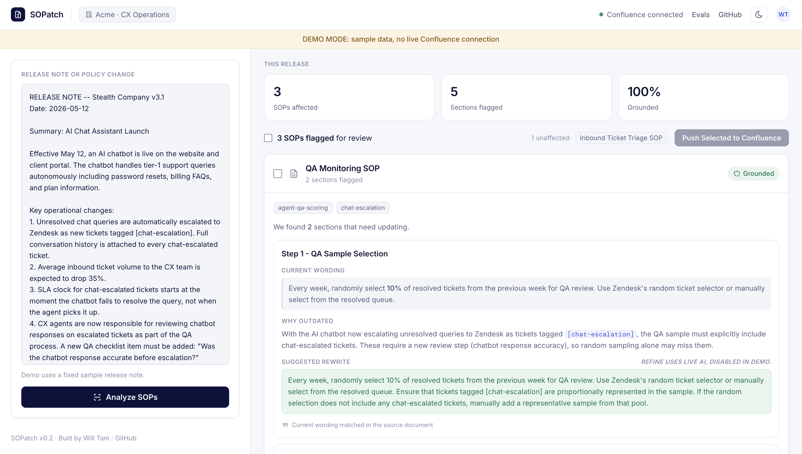
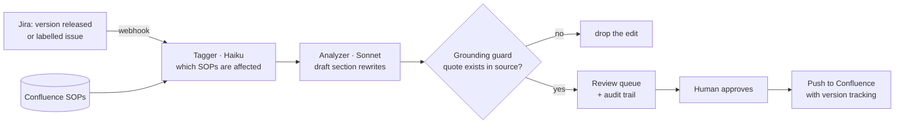

# SOPatch

Keeps your Confluence SOPs from silently going stale. SOPatch watches Jira, and
when a release or policy change ships it flags the affected SOP sections, drafts
rewrites grounded in the source document, and queues them for a human to approve.
It runs itself, a person still signs off, and every change is auditable.

[](https://github.com/willtam65/SOPatch/actions/workflows/ci.yml)   



**More than a wrapper:** a deterministic grounding guard that drops any edit whose
quoted current wording isn't in the source SOP, a precision and recall eval harness
for the part that actually matters (which SOPs to touch), and a review queue with an
append-only audit trail so nothing reaches your wiki unapproved.

## What it does

1. **Watches Jira.** A released version, or an issue labelled as a policy or
   process change, posts to `/webhook/jira` and SOPatch starts on its own. Nobody
   has to remember to paste anything (you still can, by hand, if you want to).
2. **Finds the affected SOPs.** It reads your SOPs from Confluence and uses Claude
   to work out which ones the change makes stale.
3. **Drafts grounded edits.** For each flagged section it writes a rewrite, then
   drops any edit whose quoted current wording can't be found in the source SOP, so
   it never invents a change to your wiki.
4. **Queues it for a human.** A reviewer is notified with a link to a review page,
   approves or rejects in one click, and the decision is recorded against them.
5. **Keeps an audit trail.** Every change is traceable from the Jira source to the
   SOP edit to the person who approved it, then pushes back to Confluence with
   version tracking.

## How it works

The pipeline is cost-tiered on purpose: cheap classification runs on a small model,
and the quality-critical rewriting runs on a stronger one. The grounding guard is
real code, not a prompt instruction, and the human sits between the draft and the
wiki.



## Stack

- Python / Flask
- Claude API (Haiku for cheap tag extraction and the content gate, Sonnet for analysis and rewrites)
- Confluence REST API
- Vanilla JS frontend

## Evaluation

The hard part of a tool like this isn't generating text. It's knowing whether
the *tagger* picked the right SOPs. That's a set-prediction problem, so it's
measured with precision/recall against a hand-labeled gold set (`evals/`).

```bash
python -m evals.run_eval --dry-run   # validate the dataset, no API key needed
python -m evals.run_eval --live      # real metrics (needs ANTHROPIC_API_KEY)
python -m evals.run_eval --replay    # re-score saved model outputs, no API calls
```

The eval earned its keep immediately. The original matcher used exact-string
label intersection, and the eval showed it was missing real cases: the model
extracted `weekly-cx-reporting` but the label was `weekly-reporting`, so they
never matched. **The misses were retrieval, not the model.** Replacing exact
matching with a token-aware matcher (`core/matching.py`) recovered them. Scored
by replaying the *same* model outputs on the original 14 cases, so the only
variable is the matcher:

| Matcher | Precision | Recall | F1 | Exact-match |
| --- | --- | --- | --- | --- |
| Exact string | 1.00 | 0.81 | 0.90 | 12/14 |
| Token-aware | 1.00 | 1.00 | 1.00 | 14/14 |

End to end on the full set (now 20 labelled cases, run live) it scores around
**precision 0.95, recall 0.95**, give or take a little run to run since tag
extraction is non-deterministic. The misses are SOPs the release note really
affected, but whose labels the model's extracted tags didn't happen to overlap.

The fix for that is matching on document content, not label strings. At a few
dozen SOPs a vector index is overkill, so instead there's an optional **content
gate** (`SOPATCH_CONTENT_GATE=1`, or `run_eval --gate`): a second pass that asks
the model which of the label-missed SOPs are actually affected, reading their
content. Measured, it's a deliberate tradeoff, not a free win:

| Matching | Precision | Recall | F1 |
| --- | --- | --- | --- |
| Label match (default) | ~0.95 | ~0.95 | ~0.95 |
| Label match + content gate | ~0.88 | ~1.00 | ~0.93 |

The gate catches every stale SOP (recall ~1.00) but over-flags a few tangential
ones, lowering precision and adding a call per analysis. That F1 cost isn't
worth it for most runs, so it's left off by default and turned on when recall
matters more than a reviewer dismissing the occasional false alarm. Scoring is
pure and unit-tested (`pytest`), so CI runs it without secrets.

The eval also gates cost. The pipeline runs tag extraction and the content gate
on Haiku and the SOP analysis on Sonnet, rather than Opus across the board,
which cuts token cost by roughly 75% with no measurable accuracy drop on this
set (re-running the eval after the switch is what confirmed it).

## Setup

```bash
git clone https://github.com/willtam65/SOPatch.git
cd SOPatch
pip install -r requirements.txt
cp .env.example .env
# Fill in your credentials in .env
python3 app.py
```

Open `http://localhost:5001`

## Demo Mode

Want to try the full workflow without any credentials or setup? Run SOPatch in
Demo Mode. It uses bundled sample data, makes **zero external API calls**, and
needs no Anthropic or Confluence keys.

```bash
SOPATCH_DEMO=1 python3 app.py
```

Then open `http://localhost:5001`. (You can also leave the env var unset and just
visit `http://localhost:5001/?demo=1`.)

In Demo Mode you get the complete experience. You can analyze a fixed sample
release note, see the flagged SOP sections, view the before/after diff, and
reach the push step, all from local files in `data/`. The release note is pre-filled and
read-only, the Refine button is disabled (it needs live AI), and the live
Confluence push is replaced with a demo notice (nothing is sent to Confluence).

With valid credentials and Demo Mode off, the app runs the real live flow exactly
as normal.

## Automated trigger (Jira)

Pasting a release note by hand is the thing the tool exists to stop you
forgetting, so SOPatch can start itself. Point a Jira webhook at
`POST /webhook/jira`. When a version is released, or an issue is labelled
`policy-change` / `process-change` / `sop-update`, SOPatch reads the change note
(handling Jira Cloud's ADF format), runs the analysis, and notifies a reviewer.
The notification goes to Slack when `SLACK_WEBHOOK_URL` is set, otherwise it is
logged, so the whole loop is demonstrable with no external service.

```bash
# Demo Mode: fire the trigger with the bundled sample Jira payload.
SOPATCH_DEMO=1 python3 app.py &
curl -X POST http://localhost:5001/webhook/jira \
  -H 'Content-Type: application/json' \
  -d @data/sample_jira_webhook.json
```

Set `JIRA_WEBHOOK_SECRET` to require a matching `X-Webhook-Secret` header. The
next step (see [ROADMAP.md](ROADMAP.md)) is a live Jira OAuth connection and real
Slack/email delivery.

## Review queue and audit trail

The webhook notification is not a dead end. Each run is recorded, and the
notification links straight to a review page (`/review/<id>`) that shows the
change that triggered it, every flagged SOP with a before/after of each drafted
edit, and Approve / Reject controls. Approving or rejecting is one click and is
attributed to the reviewer with a timestamp.

Every step is written to an append-only audit trail, so a change is traceable
end to end: the Jira source, the SOPs it flagged, and who approved it and when.
The queue at `/reviews` lists every run and its status. It is backed by SQLite
from the standard library, so there is no extra dependency and the demo needs no
database to run.

In Demo Mode the dashboard's **Simulate a Jira release** button posts to the real
`/webhook/jira` endpoint, so it creates a genuine persisted review and links
straight to it. The whole loop (detect, analyze, ground, notify, review, approve,
audit) is demonstrable in the browser with no external service and no curl. There
is a shot by shot walkthrough in [docs/DEMO_SCRIPT.md](docs/DEMO_SCRIPT.md).

```bash
SOPATCH_DEMO=1 python3 app.py &
curl -sX POST http://localhost:5001/webhook/jira \
  -H 'Content-Type: application/json' -d @data/sample_jira_webhook.json
# The response includes a review_url. Open it, or browse the queue:
open http://localhost:5001/reviews
```

## Deploy

The public demo runs in Demo Mode (no keys, no external calls), so it's safe to
expose. Served by gunicorn. Locally:

```bash
docker build -t sopatch .
docker run -p 5001:5001 -e SOPATCH_DEMO=1 sopatch   # http://localhost:5001
```

On Render: open **New**, choose **Blueprint**, and point it at this repo.
`render.yaml` deploys the demo on the free plan with a `/healthz` liveness check.

## Environment variables

```
ANTHROPIC_API_KEY=
CONFLUENCE_BASE_URL=https://yourcompany.atlassian.net
CONFLUENCE_EMAIL=
CONFLUENCE_API_TOKEN=
CONFLUENCE_SPACE_KEY=
CONFLUENCE_SOP_PARENT_ID=
```

## Roadmap

Where SOPatch is headed, and what it deliberately defers and why, is in
[ROADMAP.md](ROADMAP.md). The short version: the next real build is an automated
trigger (watch Jira for the change and run itself), not more manual input.

## Built by

Will Tam, [LinkedIn](https://linkedin.com/in/willtam65)
